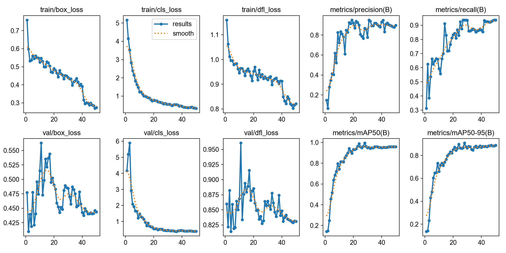
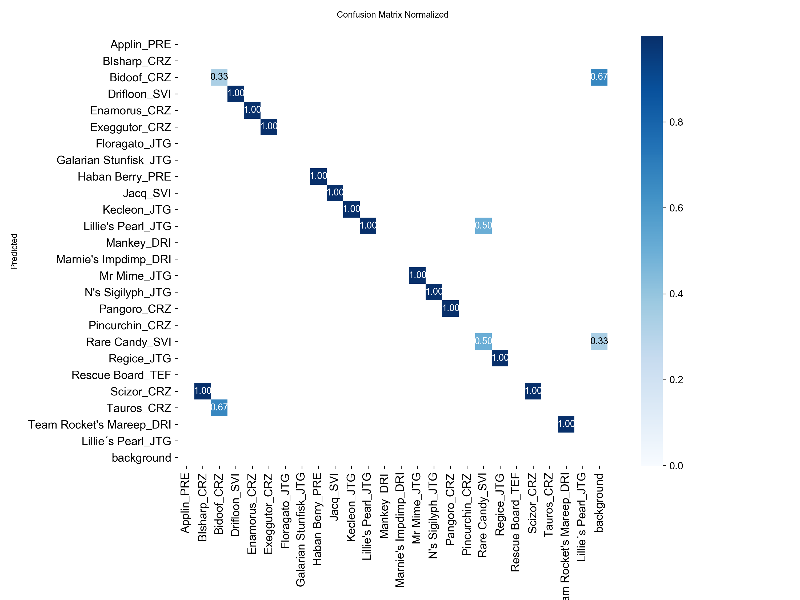

# Card Detector

Sistema de visão computacional para detecção e classificação de cartas em tempo real. O modelo YOLO11s foi treinado do zero com dataset próprio, capaz de identificar 25 classes diferentes a partir de imagens, vídeos ou câmera ao vivo.


---

## Funcionalidades

- Detecta e classifica 25 classes customizadas de cartas
- Suporta múltiplas fontes de entrada: imagem, pasta de imagens, vídeo e webcam USB
- Exibe bounding boxes e porcentagem de confiança para cada detecção
- Gravação opcional do resultado em vídeo
- Arquitetura modular separando captura, inferência e renderização

---

## Requisitos

- Python 3.10+
- [Ultralytics](https://github.com/ultralytics/ultralytics)
- OpenCV

Instale as dependências:

```bash
pip install ultralytics
```

---

## Configuração

1. Clone o repositório:

```bash
git clone https://github.com/ProGabrielH/card-detector.git
cd card-detector
```

2. Baixe o [modelo treinado](https://drive.google.com/file/d/1SlnIIA-Uk1Mo7_lDaLkI7svllfMw3cl4/view?usp=sharing) e coloque-o dentro da pasta `model/`.

---

## Uso

**Imagem:**
```bash
python src/main.py --model model/my_model.pt --source sample/sample.jpg
```

**Pasta de imagens:**
```bash
python src/main.py --model model/my_model.pt --source sample/
```

**Vídeo:**
```bash
python src/main.py --model model/my_model.pt --source video.mp4
```

**Webcam:**
```bash
python src/main.py --model model/my_model.pt --source usb0
```

**Com resolução customizada e gravação:**
```bash
python src/main.py --model model/my_model.pt --source usb0 --resolution 1280x720 --record
```

### Argumentos

| Argumento | Descrição | Padrão |
|---|---|---|
| `--model` | Caminho para o arquivo `.pt` do modelo | obrigatório |
| `--source` | Fonte de entrada (imagem, pasta, vídeo ou `usb0`) | obrigatório |
| `--thresh` | Confiança mínima para exibir detecções | `0.5` |
| `--resolution` | Resolução de exibição (`LARGURAxALTURA`) | resolução da fonte |
| `--record` | Grava o resultado em `demo.avi` (requer `--resolution`) | desativado |

### Atalhos de teclado

| Tecla | Ação |
|---|---|
| `q` | Sair |
| `s` | Pausar |
| `p` | Salvar captura como `captura.png` |

---

## Resultados do treino

<table>
  <tr>
    <td></td>
    <td></td>
  </tr>
</table>

---

## Licença

Este projeto foi desenvolvido para fins educacionais e de portfólio.
